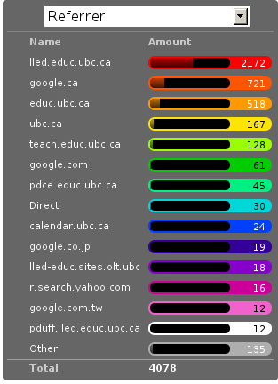
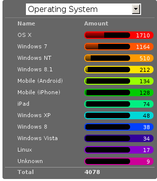
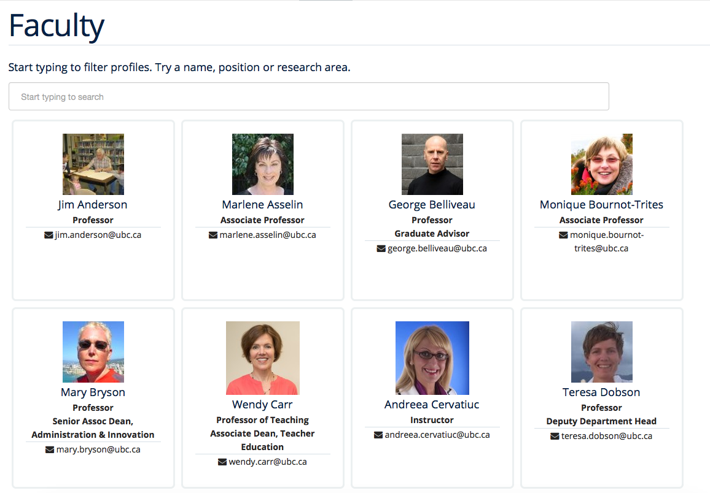

= LLED Website Transition Report
Darshan Soni <darshan@alumni.ubc.ca>
:source-highlighter: coderay
:toc: left
:stylesheet: material.css
:icons: font

== Introduction

This report details the LLED website update from January 2016 to the end of July 2016.

== Work plan: January - April

.Workplan for Winter 2016

[width="80%" options="header"]
|========
|Time period | Activity
|January 8 - January 25 | Site hierarchy and review of page structure
|January 14 - February 10| Page and information reorganisation - Improving information layout
|January 21 - February 19 | Analytics on site usage - prioritising where information is placed on the website to make it easy to use
|January 27 - March 1| Information updating - collaboration with LLED faculty / staff / students
|February 18 - March 18| Aesthetic review - theming the site and developing a distinct LLED user interface
|February 18 - March 18| Updating the "People" page plugin to showcase the LLED faculty and their research better
|March 4 - March 10| Information review and revision
|April 15 - April 29 | Reveal site on April 15 and evaluate it until the 29th
|========

NOTE: These milestone dates are subject to change during the course of the project.
The website update will be extended to September 2016. In this case, the 2nd phase will focus on developing better content for the site, including working with more photography, writing and user interface design.

== Work plan: May - July
NOTE: First reveal to stay on Schedule - Week of April 15th

A detailed workplan is shown below, followed by a summary table.

.April 15 - April 30

- Complete migration by syncing up all posts and articles so the old site can be fully archived.

- Evaluate site immediately after reveal.
  * Bug fixes - There are guaranteed to be some hitches with the new site.
  * Receive first feedback from LLED faculty using the new site.

.May 1 - May 20

- Implement fixes to new site based on feedback.

- Resume documentation work on:
  * LLED style guide for staff to have as reference.
  * Detailed web developers report for any future technical staff that need to revamp the website. The aim for this is to make sure that as many resources are easily available for a future web developer to work off, saving time. In the event that anything major changes across the faculty (e.g. plugins get rewritten) someone from Education will be able to fix any issues with the site quickly. If there is any university wide change (e.g. the entire Wordpress platform), same thing.

- Discuss with Faculty members potential ways of enriching the information in their own profiles (preferably in person if possible)
  * What would they like to see? How can we add more value to their bio pages and link it with their research work?

.May 21 - May 31

- Begin in-depth development of Faculty members profile pages to improve the content quality within them.

- Current students feedback session discussing what they like / dislike about the website and what features they would like to add to it.

- Complete and review the Research section, populating it with content from Faculty members and Students.

.June 1 - June 15

- Begin implementation of new bookings and shared calendar page.
  * This page allows people to book rooms online and view the calendar, reducing the need for Ana / Lia / Laurie to have back and forth emails about bookings.
  * Equipment can be booked and approved, people just have to come to the office for collection / return.

- Develop and improve the courses feature.
  * New UBC plugin that will automatically display courses, pulling in content from the UBC calendar.
  * Plugin will also allow a snippet on each Faculty members profile showing what courses they will be teaching in the current / upcoming session. This will also be automatic so it will not require constant updating.
  * Takes away need for Ana to manually populate and change course offerings on the website.

.June 16 - June 30

- Complete implementation of the bookings page.
  * This will involve some work with IT and CTLT as the plugin is very new and poorly documented.

- Carry out final content review with Chris / Lia before the new academic year begins.
  * Make sure all the information is easy to access and relevant for incoming students.

.July 1 - July 15

- Complete implementation of courses feature.
  * Test it on the website and replace the old list of courses with the new plugin.
  * Complete placement of individual Faculty members' courses on all their profiles.

- Carry out final evaluation discussion with Staff, Faculty and graduate Students.
  * Any shortfalls will be documented along with patches to solve some of those shortfalls once there is no more "website guy".

.July 15 - July 31

- Briefing Ana on the most involving features of the website.
  * Especially things like bookings, updating research content etc.

- Buffer space in case of some features taking longer to complete and implement.
  * Quite likely, especially when I have to collaborate with the other Education departments or CTLT - who take notoriously long for testing features before approving them.

.Summary table for Summer 2016

[width="80%" options="header"]
|====
|Month | Work plan summary
| April | Site rollout. New site evaluation and migration of posts. Feedback sessions.
| May | Acting on feedback, style guide and technical documentation, faculty profiles enrichment, grad students feedback, research section completion.
| June | Room bookings and shared calendar development, new courses feature, final content review.
| July | Complete courses feature, final evaluation with faculty, staff, students. Briefing Ana. Buffer space for all the other features.
|====

== Website Analytics

The following analytics were taken over a 3 month period from January to March 2016. They were used extensively in designing the new website by passively observing user behaviour on the website to see where users clicked, spent time, got lost or ignored. All analytics data was anonymous in that no personal data was collected, no user could be named: it simply looked at clicks. User inputs such as search terms were not collected and all payments pages were excluded.

The analytics tools were graciously provided by Olga Glukhovska, a UX specialist who worked with UBC Marketing and Communications at the time.

=== New vs Returning users
When the user interface was designed, new and existing users were taken into consideration because that determines the balance of a familiar design vs an attractive, novel layout.

image::images/NewVsReturning.png[]

=== Search referral

Interestingly, the vast majority of users accessed the site directly (through lled.educ.ubc.ca). This indicated that most users were very frequent users that bookmarked the site / used the search bar suggestion in their browsers. From those that used search engines, Google was by far the most popular choice, with the search term "ubc lled". Note that the 4020 "None" search terms are a result of some browsers not submitting search data / privacy settings.

Using the search referral data, the LLED website can be optimized to be the top link on Google with search terms such as "ubc lled". This ensured that new users find the site without too much hassle.

image::images/SearchWords.png[]
image::images/SearchEngine.png[]

=== OS and Browser choices

Operating system and browser choices are an important metric to design the site to display well on as many devices as possible. Chrome and Firefox are all well supported and display multimedia-rich websites well. Web standards are often tailored for them leaving very few performance issues. Safari is popular and well supported but often requires some "exceptions" to make sure features such as embedded videos work. Internet Explorer 11 users have some performance issues but would be able to view most content.
Users of Internet explorer versions below 10 would suffer from many glitches and poor security. Because there are only a handful of IE 7,8 and 9 users the website will be extensively designed for modern browsers. The demographic of IE users is expected to decline following the transition to "Microsoft Edge" browsers and so no special efforts will be made to make website features available to obsolete browsers. Having said that, all text content would be readable to them, only multimedia features such as embedded video or display optimizations would be broken.

 image:images/Browser.png[]

=== Device size

While the new CLF is fully scalable - displays well on desktops, mobiles and tablets - it's important to factor in what devices users are accessing the site from to ensure content is designed to display well. A popular trend in web development at the time of this report is to design websites to be mobile first. This means content is designed to be viewed on a mobile device only, assuming it would display well enough on a desktop device. While developing this website, I have chosen to deliberately differ from this status quo. I have instead chosen to design the new LLED site to be "Device Agnostic" meaning it is designed for all devices in mind, regardless of their screen size, but optimised for the most popular device. The analytics data shows that website access on a mobile device is exremely low. Therefore, while the site remains accessible to all devices, no special attention will be given to make sure it displays well on a mobile screen. This fits in line with the typical usage of the site as an information hub. Faculty members are likely to access it from a computer while working, staff are all equipped with a desktop screen and students are unlikely to review application requirements or complete entire applications from a mobile device.

Pages such as "Contact Us" could occasionally be pulled up on a mobile device to quickly find information, and such pages have been designed to deliver information quickly.

image::images/WindowWidth.png[]

=== Other analytics

Some other analytics that aren't used, but interesting to know anyway...

image::images/Country.png[]

image::

---

== Site Navigation

=== Page structure

Before editing each page and the user interface of the site, it is important to evaluate the site structure itself to make sure it is easy to navigate without any fancy styling / search feature added. The idea is to make sure the page hierarchy is intuitive to a first-time viewer, but also familiar to a faculty or staff member who just needs to get things done efficiently.

=== New page structure

Option 1 for the page structure is outlined below:

image::images/PageStructureOption1.png[]

The proposed layout addresses the issue of making a site intuitive but also familiar for long term users. A major issue with the old website was the lack of distinction between who views a page - A new user seeking information vs an old user who needs access to resources and links.

.Cleaning up the main menu

A short, clean main menu is important so as not to overwhelm new users of the site. The old layout of the site was largely clean and in step with most other UBC units, but the *Visiting scholars and students* section seemed out of place. Recognising that Faculty members need this to be accessible, it needed to be removed from the main menu, but still kept in an accessible location.

A possible result is to find a way group this together with Faculty and Staff but ensuring they remain a distinct group.

.Grouping Visiting students with students

The students page on the old site has only prospective and current students listed. Adding the visiting students page here is intuitive as they are likely to describe themselves first and foremost as students, and would go to the link without much hassle. This leaves *Visiting Scholars and Fellows* to deal with.

.Creating a People tab

The Visiting scholars and fellows pages can be moved to be grouped with the Faculty and Staff page. However, they are a distinct group and so the page can be renamed "People" to include all the groups it exhibits. The concept is similar to the one used on the ECPS department website, http://ecps.educ.ubc.ca/people/

This allows all the people involved to be easily explored in terms of area of expertise or research interests.
In the old website, the *Faculty and staff* page has served a dual purpose in:

1. Showcasing faculty and staff members to prospective eyes.

2. Providing information and resources to existing faculty and staff members.

This can become confusing once the page is labelled *People*. To counter this all current Faculty and staff resources can be moved to a separate section.

.Creating a Resources section

As a result, a Resources page can be created to serve as a point of reference for all documents such as forms, policies and applications. The new Resources page will be further split into a students section and a faculty and staff section. Prospective student pages can also cross-link to these new pages for application forms etc.

NOTE: Anthony suggested adding a dedicated Research page as well. This would showcase Faculty and Grad student research like news articles. The page would also have an archive section with annual research material.

---

== Style Guide

=== Headings
Use standard html notation for adding headings.
This:
[source,html]
----
<h1>First level heading</h1>
<h2>Second level heading</h2>
<h3> Third level heading </h3>
----

Displays this:
****
[float]
= First Level Heading
[float]
== Second Level Heading
[float]
=== Third Level Heading
****

Try to ensure they maintain hierarchy within the page. e.g. If a section is nested under "Applications" and "Applications"  is a h2 level heading, then the new nested section should get a h3 level heading.

=== Lists

For ordered lists,
This:
[source,html]
----
<ol>
  <li> Item 1
  <li> Item 2
  <li> Item 3
</ol>
----

Displays this:
****
1. Item 1
2. Item 2
3. Item 3
****

For unordered lists,
This
[source,html]
----
<ol>
  <li> Item 1
  <li> Item 2
  <li> Item 3
</ol>
----

Displays this:
****
* Item 1
* Item 2
* Item 3
****

=== Links

To place a link, copy the following code and replace the sections in it with what you want to render:

[source,html]
----
<a target="_blank" href="PASTE_LINK_IN_HERE">TEXT_TO_DISPLAY_HERE</a>
----

In page links are simple to implement but if there are too many in a large body of text, place them below the text body in question, in a **button** instead. See the Buttons styling section for more on this.

NOTE: Links should preferably open in a new tab by default (subject the author's discretion). This avoids users having to lose the page they are currently on. The `target="_blank"` part implements this automatically.

---

=== Buttons

Buttons are very important on this site and draw the attention of viewers quickly. They are designed to stand out and appeal to users so that external content links are easily found. Actions such as applications are also quick to spot.

A button is simply a link, with added styling to make it behave like a button.

To implement a button linking to another page, copy the following code:

[source,html]
----
<a class="btn btn-default" target="_blank" href="PASTE_LINK_IN_HERE">TEXT_TO_DISPLAY_HERE</a>
----

=== Coloured Buttons

To colour code the buttons according to the page they're on (e.g. yellow for MEd or Green for MA) simply add the colour name to the button class. For example, to add a green button, use the following code:

[source,html]
----
<a class="btn btn-default green" target="_blank" href="PASTE_LINK_IN_HERE">TEXT_TO_DISPLAY_HERE</a>
----

The following colour codes can be used: red, blue, yellow, green, purple and greybutton. Greybutton is named so to avoid conflict with UBC grey classes that exist in every CMS site.

---

=== Colours
The LLED site uses a neutral accent colour for all elements that gives a nice visual change from the mandatory UBC Blue on the site headers and footers.

==== UBC Colours

For UBC default colours see UBC Brand Guidelines: http://brand.ubc.ca/about-the-brand/visual-identity-system/colour/.

==== LLED Neutral Blue

[width="80%" options="header"]
|====
| Colour | Hex | Name
|image:images/blue.png[] | #3498db| Peter River **Blue** |
|====

==== Program colour codes

[width="80%" options="header"]
|====
| Colour | Hex | Name | Class
| |#e74c3c| Alizarin **Red** | Certificate
|image:images/blue.png[] |#3498db| Peter River **Blue** | Diploma
| |#f1c40f| Sun Flower **Yellow** | MEd
|image:images/green.png[] |#2ecc71| Emerald **Green** | MA
|image:images/purple.png[] |#9b59b6| Amethyst **Purple** | EdD
| |#95a5a6| Concrete **Greybutton** | PhD
|====

These colours are recommended secondary colours specified by the faculty. They are listed at http://flatuicolors.com

---

=== Posts

==== Homepage carousel (scrolly image)
To add a new article on the homepage follow these steps:

1. Create a slider image according to the specifications outlined [here]().
2. On the site dashboard, click "New" and select "Post".
3. Give it a title and then click on "Add Media" and upload the slider image.
4. Click on "Set a featured image" and select the same image you uploaded.
5. Under the "Categories" menu, select the category the post belongs in (usually "News and Events") and then select "Slideshow" if you also want the post to appear on the home page carousel.

==== Research page post

To add a new post to the research page, go to "Research". At the bottom is a "Submit new article". This opens a form that allows faculty members and graduate students to submit a new article. A staff member will receive an email every time a post is submitted and they have to verify that it is accurate. Once they approve the post, the article will be displayed on the Research page.

---

=== The Spotlight

Spotlight is a crucial part of the LLED website. It refers to the pale grey, rounded box that surrounds "cards" of information. It is used on the Research page, News and events, Departmental resources etc. The spotlight box is designed to draw attention to small bits of content, making them noticeable and easy to read. It has a pale grey focus when hovered over to give the user some focus on the particular area of the page they want to look at.

To use the spotlight, simply append the term "spotlight" on any div or section. E.g.

[source,html]
----

  <h2>Heading</h2>
  
All this stuff is in a spotlight

----

<<<

== Site Features

=== Job Postings

Job postings can be added the same way as any other post, simply remember to choose the "Job Posting" category before publishing. After a Job Posting has expired, edit it and change it's category to "Job Posting - Archive".

Job postings have some specific formatting that needs to be followed. It may be best to open up an already existing Job Posting and copy data to the blank one you are making. Then edit the fine details.

Each job posting needs to have the following:

1. Insert a title to briefly describe the area of employment e.g. Summer 2016 - Teaching English as a Foreign Language GTAs.
2. Add a heading (h3 level) for the job  e.g. Part-time Graduate Teaching Assistants.
3. Upload a PDF version of the posting by clicking on "Add Media". This will add a `<a href=...` section in the post.
4. Below that `<a href=...` line, paste the following and add the correct date:

[source,html]
----
Application deadline: <strong>May 20, 2016</strong>
----

Then, in the Excerpt section, paste the following code in, editing the position and deadline as necessary:

[source,html]
----
Part-time Graduate Teaching Assistants  
Application deadline: <strong>May 20, 2016</strong>
----

TIP: Remember to click on "Job Posting" as the category.

=== Courses

Courses on the new site are pulled in automatically from the calendar to avoid the tedious work of making posts for each course in each session. The new Courses page is set up to automatically display the Winter and Summer courses for the current year. This means no additional work for the office staff in terms of displaying courses on the front end. The downside of this is that office staff no longer have control over the titles and data displayed. As a compromise, each course accordion has a "Note" section before displaying courses. This section can be manually edited to point out whether courses are cross-listed or have special titles set by the instructors that are not reflected by UBC calendar. This isn't the same degree of control as the old site, but it also eliminates the need for hours of course information input, communication erros and site clutter due to too many posts.

.Technical details

The courses are pulled in using the courses-shortcode plugin. This is relatively new and LLED would be the first department within the faculty to make use of it.

Winter courses are pulled in using the following:

[source,html]
----
[ubccourses department="LLED" stickyyear="true" stickywinter="W" tabcount="g"]
----

* department = "LLED" filters only LLED courses out.
* stickyyear with a true value makes sure the year is always the current one.
* stickywinter should get the value of "W" for winter courses or "S" for summer courses.
* tabcount is used to filter the level of courses you want to display. "n1" is for 100 level. "n2" for 200 and so on. "u" is undergraduate while "g" is graduate.

=== Programs

The new Programs pages are designed to make it easier to find a program and browse through it. Once a program is selected, it has a dedicated single page that guides prospective students through everything from entrance requirements to a convenient "Apply now" button.

.The new programs page

.Alternative view of programs by area
image::images/ProgramsAlt.png[]

.An example of in-page navigation

=== Resources

==== Departmental Resources

The departmental resources page is an information based page used frequently by Faculty and Staff. Analytics from the old site indicated that users were often lost on the page and found it difficult to locate a particular item.

The redesigned page has bold icon categories to visually guide users to a particular section using the Spotlight feature. Each link is then listed clearly, including it's document type (e.g. PDF or Word) so that users can get exactly what they want without spending time searching for it.

.The new departmental resources page

==== Student Resources

Student resources are not as frequently used as the departmental ones. There are more external links and based on the widespread variation in clicks, users are more likely to end up on the page out of curiosity than out of necessity. The page can therefore be used as a showcase to common questions and outline some important topics such as plagiarism. The page is designed to be more "fun" to look at with many animated tiles.

.The new student resources page
image::images/StudentResources.png[]

<<<

=== People

The new People pages showcase the Faculty, Sessional and 12 month lecturers, Staff and Emeritae/Emeriti.

All the subpages listed above were on separate sections of the old website. Putting under 1 umbrella - people - makes it easier to look for a particular person in the department. Each profile is housed in with the Spotlight feature. This allows listed people to stand out, but still be shown equally on a page.

.Example of a "People" page - The Faculty page

== Quick How-to Guide

=== Homepage

==== Carousel image

To update the carousel with a new image,

1. Create a slider image according to the specifications outlined [here]().
2. On the site dashboard, click "New" and select "Post".
3. Give it a title and then click on "Add Media" and upload the slider image.
4. Click on "Set a featured image" and select the same image you uploaded.
5. Under the "Categories" menu, select the category the post belongs in (usually "News and Events") and then select "Slideshow" if you also want the post to appear on the home page carousel.

==== Twitter Widget

At the time of writing this report, the twitter widget works and displays all content. The widget is not maintained by UBC, it is the standard twitter embed feature.

Some users report not seeing the widget. In this case, it's normally due to their browser's ad-blocker plugin. If they report this issue, the best advice might be to add this particular widget to the "safe" list on their ad-blocker.

=== Job posting

See the section on <<_job_postings>>

=== New and events

Make a new post. Before publishing, ensure that the category selection in the panel to the right of the page is "New and events".

=== Research

This page will auto-populate with all posts that are given the "Research" category.

To make a new post, visit the http://lled.educ.ubc.ca/research/[Research] page and click on "Submit new post". Enter in all the details here and submit the post.

Because this feature is publicly available, the post will be saved as a draft instead of being published. A site administrator (member of staff e.g. Ana or Lia) would receive an email about it, and can then go in to the site and approve the post.

WARNING: Adding a post in the Research category should be done as outlined above instead of the usual manual post creation method because there is a preset format for the post. Creating a post manually (New -> Post) and then creating content from scratch would be cumbersome and would display poorly on the page.

NOTE: The Research page automatically pools in all the research posts and displays a selection of the latest ones in a mosaic-like layout. This is all done automatically according to a best fit model. Changing the layout of the page should be done very carefully.

=== Courses

See the section on <<_courses>>

=== Programs

The programs landing page is CSS heavy. The content on it rarely needs change, unless an entire program is renamed / scrapped or added. In this instance, try and use the **text** layout, instead of the **visual** one to edit content. The text layout window may look ugly with a lot of html markup, but it's important to be able to tell where you're putting in content so you don't break the page layout. This is not a difficult task but should be done by someone who is somewhat familiar with basic HTML / CSS notation.
